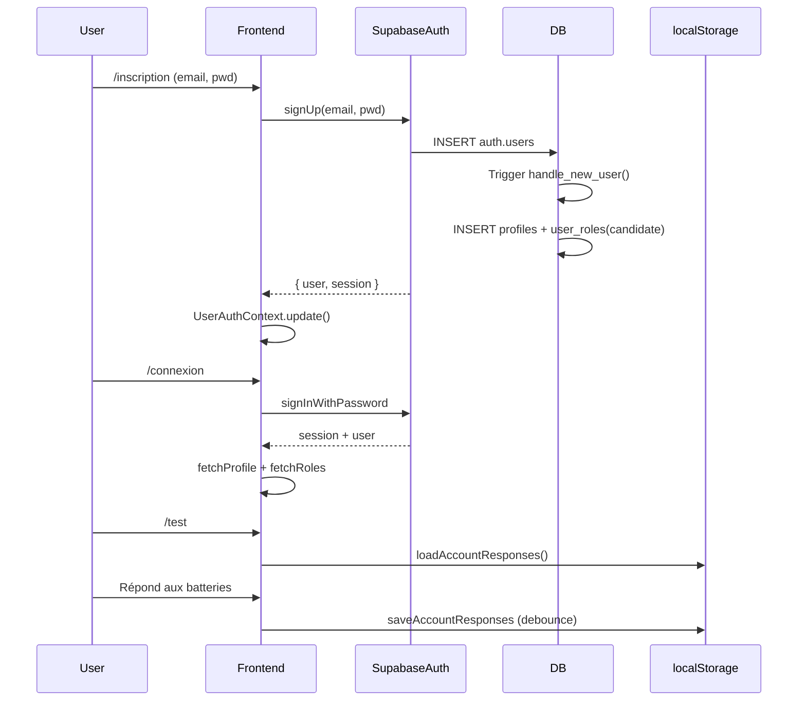

# Authentification

## Vue d'ensemble

L'authentification est gérée par **Supabase Auth** (email/password). Toute la logique réside dans deux contextes React : `UserAuthContext` (candidat) et `AdminAuthContext` (administrateur).

> **Important** : L'authentification admin utilise les mêmes comptes Supabase que les candidats, différenciée par les rôles (`admin`, `super_admin`) dans `user_roles`.

---

## Flux candidat

### Inscription (`/inscription` → `Register.jsx`)

```js
UserAuthContext.register(email, password)
  → supabase.auth.signUp({ email, password })
  → Trigger DB handle_new_user() → profiles + user_roles(candidate)
  → Si email non confirmé : retour erreur "confirmez votre email"
```

### Connexion (`/connexion` → `UserLogin.jsx`)

```js
UserAuthContext.login(email, password)
  → supabase.auth.signInWithPassword({ email, password })
  → Succès → UserAuthContext met à jour user/session
  → UserRoute guard → /test
```

### Session

- `supabase.auth.getSession()` au chargement
- `onAuthStateChange` → met à jour user/session/profile/roles/permissions
- `UserAuthContext` expose : `user`, `session`, `profile`, `roles`, `permissions`, `loading`, `hasRole()`, `hasPermission()`

### Déconnexion

```js
UserAuthContext.logout() → supabase.auth.signOut() → navigate('/connexion')
```

---

## Flux administrateur

### Connexion (`/login` → `Login.jsx`)

```js
AdminAuthContext.login(email, password)
  → supabase.auth.signInWithPassword({ email, password })
  → checkAdmin(session) → user_roles (admin/super_admin)
  → isAuthenticated = true
  → ProtectedRoute → /admin
```

### Vérification admin (`AdminAuthContext.checkAdmin`)

```js
async checkAdmin(session) {
  if (!session?.user) return false;
  const { data } = await supabase
    .from('user_roles')
    .select('role_id')
    .eq('user_id', session.user.id)
    .in('role_id', ['admin', 'super_admin'])
    .single();
  return !error && !!data;
}
```

### Session admin

- `isAuthenticated` : boolean
- `adminUser` : `auth.User` | null
- `loading` : boolean
- `login()`, `logout()`

### Déconnexion admin

```js
AdminAuthContext.logout() → supabase.auth.signOut() → navigate('/login')
```

---

## Super Admin

- Utilise `UserAuthContext` + `SuperAdminRoute` (guard `hasRole('super_admin')`)
- Même session que candidat/admin (même `auth.users`)
- Différenciation par rôle `super_admin` dans `user_roles`

---

## Réinitialisation mot de passe

### Demande (`/mot-de-passe-oublie` → `ForgotPassword.jsx`)

```js
UserAuthContext.resetPassword(email)
  → supabase.auth.resetPasswordForEmail(email, { redirectTo: '/reinitialiser-mot-de-passe' })
```

### Réinitialisation (`/reinitialiser-mot-de-passe` → `ResetPassword.jsx`)

- Page publique, token dans URL (Supabase gère)
- `UserAuthContext.updatePassword(newPassword)` → `supabase.auth.updateUser({ password })`

### Reset admin (côté admin)

- Admin → SuperAdminAccounts / AdminResultats → "Réinitialiser MDP"
- Appelle Edge Function `admin-reset-password` :
  1. Vérif token user + perm `users.change_role` (RPC `has_permission`)
  2. Service Role → `supabase.auth.admin.generateLink({ type: 'recovery', email, redirectTo })`
  3. Email envoyé au candidat

---

## Gestion des sessions

### Candidat (`UserAuthContext`)

- `supabase.auth.getSession()` + `onAuthStateChange`
- `loadAccountResponses(email)` → localStorage `ntc_users`
- Sauvegarde auto `saveAccountResponses(email, responses)` (debounce 400ms)

### Admin

- `AdminAuthContext` : session admin dans `ntc_auth` (localStorage)
- `ProtectedRoute` → `AdminAuthContext.isAuthenticated`

### Super Admin

- `SuperAdminRoute` → `UserAuthContext.hasRole('super_admin')`

---

## Rôles par défaut

| Rôle | Attribution | Permissions clés |
|------|-------------|------------------|
| `candidate` | Auto (trigger `handle_new_user`) | `profile.view`, `profile.edit`, `assessment.take` |
| `admin` | Manuel (Super Admin) | Toutes permissions `users.*`, `profile.*`, `assessment.*`, `results.*`, `reports.*` |
| `super_admin` | Bootstrap (SQL) ou promotion | Toutes + `users.promote_admin`, `users.promote_super_admin` |

---

## Sécurité

| Aspect | Implémentation |
|--------|----------------|
| Mots de passe | Hashés par Supabase (bcrypt) |
| JWT | Access token (1h) + Refresh token (Supabase gère) |
| Sessions | `localStorage` (frontend) + cookies HttpOnly (Supabase) |
| Reset MDP | Token à usage unique, expiration courte |
| Admin reset | Edge Function + `service_role` (jamais côté client) |

> **Note** : Mots de passe candidats stockés en clair dans localStorage (prototype). Pas de hash côté client.

---

## Flux complet : Inscription → Test



---

## Sécurité : points d'attention

| Risque | Mitigation |
|--------|--------------|
| Mots de passe en clair (localStorage) | Prototype uniquement. Production → hash côté serveur |
| Admin credentials dans bundle | `.env` seulement, pas commit. Production → backend dédié |
| Token JWT accessible | HttpOnly cookies (Supabase) + localStorage fallback |
| Reset MDP admin | Edge Function + `service_role` (jamais côté client) |
| Session hijacking | JWT courte durée (1h) + refresh token rotation (Supabase) |

---

*Dernière mise à jour : 2026-09-15*